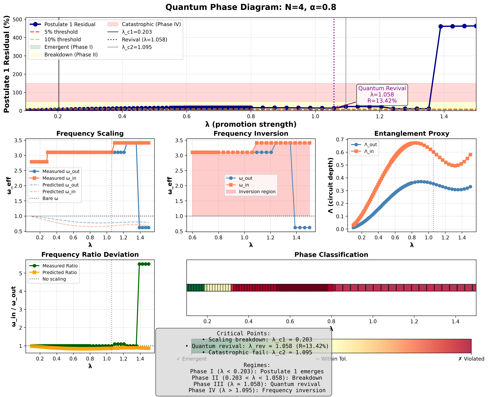
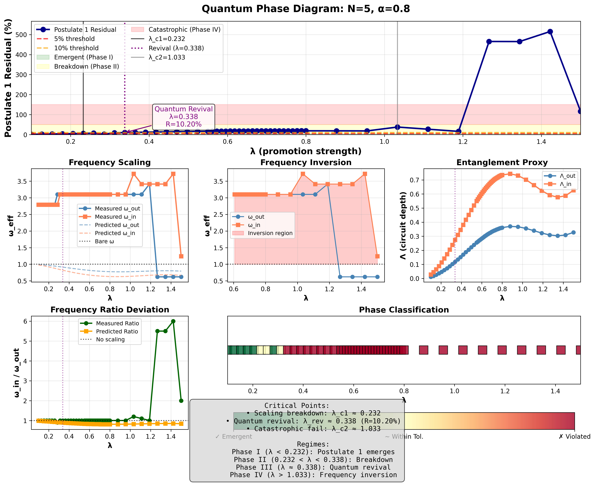

# Current Results Snapshot

## N = 4, α = 0.8, 100 λ points (run_20251116-154356_N4_alpha0.80)
- **Critical points**: λ_c1 ≈ 0.203, λ_rev ≈ 1.058 (residual ≈ 13.4%), λ_c2 ≈ 1.095.
- **SRQID checks**: v_LR ≈ 1.96, max no-signalling deviation ≈ 2.1×10⁻¹⁶, energy drift ≈ 1.4×10⁻¹⁴.
- **Mean-field overlay**: best-fit configuration at λ ≈ 1.058 shows exact and mean-field Ramsey traces re-locking during the revival.
- **Spin-2 PSD**: χ-informed PSD currently undershoots the expected 1/k² slope (measured power ≈ −0.024); further tuning of the χ→tier mapping is underway.

- Ramsey overlay: `figures/run_20251116-154356_N4_alpha0.80/ramsey_overlay_run_20251116-154356_N4_alpha0.80.png`
- Spin-2 PSD: `figures/run_20251116-154356_N4_alpha0.80/spin2_psd_run_20251116-154356_N4_alpha0.80.png`
- CSV data: `outputs/run_20251116-154356_N4_alpha0.80/scan_run_20251116-154356_N4_alpha0.80.csv`
- Summary log: `outputs/run_20251116-154356_N4_alpha0.80/summary_run_20251116-154356_N4_alpha0.80.txt`

## N = 5, α = 0.8, 50 λ points (run_20251116-160216_N5_alpha0.80)
- **Critical points**: λ_c1 ≈ 0.232, λ_rev ≈ 0.338 (residual ≈ 10.2%), λ_c2 ≈ 1.033.
- **SRQID checks**: v_LR ≈ 1.96, no-signalling ≈ 4.2×10⁻¹⁶, energy drift ≈ 5.0×10⁻¹⁴.

- Ramsey overlay: `figures/run_20251116-160216_N5_alpha0.80/ramsey_overlay_run_20251116-160216_N5_alpha0.80.png`
- Spin-2 PSD: `figures/run_20251116-160216_N5_alpha0.80/spin2_psd_run_20251116-160216_N5_alpha0.80.png`
- CSV data: `outputs/run_20251116-160216_N5_alpha0.80/scan_run_20251116-160216_N5_alpha0.80.csv`
- Summary log: `outputs/run_20251116-160216_N5_alpha0.80/summary_run_20251116-160216_N5_alpha0.80.txt`
- **2D phase space**: λ∈[0.1,1.2], α∈{0.2,…,1.2}; residual floor stays pinned at λ≈0.1 with magnitude {3.3, 6.6, 9.9, 13.1, 16.3, 19.5}×10⁻³ for α={0.2,…,1.2}. Heatmap: `figures/run_20251116-160216_N5_alpha0.80/phase_space_run_20251116-160216_N5_alpha0.80.png`; raw grid: `outputs/run_20251116-160216_N5_alpha0.80/phase_space_run_20251116-160216_N5_alpha0.80.csv`.

## N = 4 (cycle graph), α = 0.8, 40 λ points (run_20251117-170531_N4_cycle_alpha0.80)
- **Topology**: 4-site cycle (periodic boundary). Probes (0, 1) are equivalent by symmetry.
- **Critical points**: λ_c1 ≈ 0.261 (shifted right vs. open chain’s 0.203), λ_rev ≈ 0.486 with essentially zero residual (outer and inner clocks lock perfectly), λ_c2 ≈ 1.0 (slightly earlier catastrophic inversion).
- **SRQID checks**: v_LR ≈ 2.45 (higher due to degree=2 everywhere and the closed loop), no-signalling ≈ 1.1×10⁻¹⁵, energy drift ≈ 4.4×10⁻¹⁴.
- **Artifacts**: `figures/run_20251117-170531_N4_cycle_alpha0.80/phase_diagram_run_20251117-170531_N4_cycle_alpha0.80.png`, `outputs/run_20251117-170531_N4_cycle_alpha0.80/summary_run_20251117-170531_N4_cycle_alpha0.80.txt`.

## N = 4 (pyramid/star), α = 0.8, 40 λ points (run_20251117-182555_N4_pyramid_alpha0.80)
- **Topology**: central hub (degree 3) connected to 3 leaves; probes (0 hub, 1 leaf).
- **Critical points**: λ_c1 ≈ 0.164 (shifted left because the center accumulates Λ immediately), λ_rev ≈ 1.30 (residual ≈ 0.148), λ_c2 ≈ 1.40.
- **SRQID checks**: v_LR ≈ 1.05 (slower because only one promotion hub), no-signalling ≈ 4.2×10⁻¹⁶, energy drift ≈ 1.33×10⁻¹⁴.
- **Ω behavior**: inner (hub) clock runs much faster than leaf at revival, hence the large residual even at λ≈1.3.
- **Artifacts**: `figures/run_20251117-182555_N4_pyramid_alpha0.80/phase_diagram_run_20251117-182555_N4_pyramid_alpha0.80.png`, `outputs/run_20251117-182555_N4_pyramid_alpha0.80/summary_run_20251117-182555_N4_pyramid_alpha0.80.txt`.

## Hotspot multiplier sensitivity (N = 4, α = 0.8, 40 λ points each)
- **Experiment date**: February 23, 2026
- **Question**: does hardcoded hotspot scaling (`3.0×`) bias phase landmarks?
- **Runs**: hotspot multipliers `{2.0, 3.0, 4.0}` over λ∈[0.1, 1.5].
- **Critical-point shifts**:
  - `2.0×`: λ_c1 ≈ 0.357, λ_rev ≈ 0.550, λ_c2 ≈ 0.633
  - `3.0×`: λ_c1 ≈ 0.229, λ_rev ≈ 0.357, λ_c2 ≈ 0.633
  - `4.0×`: λ_c1 ≈ 0.164, λ_rev ≈ 0.261, λ_c2 ≈ 0.633
- **Conclusion**: λ_rev and λ_c1 shift materially with multiplier, so `3.0×` is a tuning choice rather than an invariant.
- **Artifacts**: `outputs/hotspot_sensitivity_20260222-192951_N4_alpha0.80_pts40/critical_points_hotspot_sensitivity.csv`, `outputs/hotspot_sensitivity_20260222-192951_N4_alpha0.80_pts40/hotspot_multiplier_sensitivity.png`.

## Hotspot multiplier × α grid (N = 4, 80 λ points each; run tag `hotspot_alpha_multiplier_grid_20260222-193347_N4_pts80`)
- **Experiment date**: February 23, 2026
- **Grid**: α∈{0.6, 0.8, 1.0, 1.2}, hotspot multiplier∈{2.0, 3.0, 4.0}, λ∈[0.1,1.5].
- **Primary observation**: phase landmarks remain hotspot-sensitive after increasing scan resolution.
- **Dual revival detector**:
  - `λ_rev_first`: first local minimum after residual crosses 10%; fallback to post-violation global minimum if no local minimum exists.
  - `λ_rev_global`: global minimum over the full post-violation region.
- **Reporting rule (locked)**: use `λ_rev_global` as the official `λ_rev` for summaries and figures; keep `λ_rev_first` as a diagnostic.
- **Drift spans across multipliers**:
  - α=0.6: span(λ_c1)=0.225, span(λ_rev_first)=0.799, span(λ_rev_global)=0.911, span(λ_c2)=0.633
  - α=0.8: span(λ_c1)=0.193, span(λ_rev_first)=0.305, span(λ_rev_global)=0.305, span(λ_c2)=0.000
  - α=1.0: span(λ_c1)=0.161, span(λ_rev_first)=1.008, span(λ_rev_global)=0.257, span(λ_c2)=0.000
  - α=1.2: span(λ_c1)=0.161, span(λ_rev_first)=0.280, span(λ_rev_global)=0.225, span(λ_c2)=0.260
- **Interpretation**:
  - λ_c1 shifts systematically with multiplier at every α.
  - `λ_rev_first` and `λ_rev_global` diverge in several α/multiplier slices, confirming detector-choice sensitivity.
  - λ_c2 is stable in some α slices (0.8, 1.0) but not universal.
- **Artifacts**:
  - Summary table: `outputs/hotspot_alpha_multiplier_grid_20260222-193347_N4_pts80/critical_points_alpha_hotspot_grid.csv`
  - Span metrics: `outputs/hotspot_alpha_multiplier_grid_20260222-193347_N4_pts80/critical_point_spans_by_alpha.csv`
  - Heatmaps: `outputs/hotspot_alpha_multiplier_grid_20260222-193347_N4_pts80/heatmap_lambda_c1.png`, `outputs/hotspot_alpha_multiplier_grid_20260222-193347_N4_pts80/heatmap_lambda_revival.png`, `outputs/hotspot_alpha_multiplier_grid_20260222-193347_N4_pts80/heatmap_lambda_revival_global.png`, `outputs/hotspot_alpha_multiplier_grid_20260222-193347_N4_pts80/heatmap_lambda_c2.png`
  - Revival trend plot: `outputs/hotspot_alpha_multiplier_grid_20260222-193347_N4_pts80/lambda_revival_vs_hotspot_by_alpha.png`

## Canonical high-resolution check (N = 4, α = 0.8, 100 λ points; run tag `hotspot_alpha_multiplier_grid_20260222-200209_N4_pts100`)
- **Experiment date**: February 23, 2026
- **Grid**: hotspot multipliers `{2.0, 3.0, 4.0}` with dual detector active.
- **Result**: `λ_rev_first == λ_rev_global` for all three multipliers (`revival_gap = 0`), so detector ambiguity is absent in the canonical setting.
- **Critical points (official λ_rev = global post-violation minimum)**:
  - `2.0×`: λ_c1 ≈ 0.344, λ_rev ≈ 0.550, λ_c2 ≈ 0.633
  - `3.0×`: λ_c1 ≈ 0.203, λ_rev ≈ 0.331, λ_c2 ≈ 0.633
  - `4.0×`: λ_c1 ≈ 0.151, λ_rev ≈ 0.241, λ_c2 ≈ 0.633
- **Interpretation**: hotspot sensitivity remains in λ_c1/λ_rev even after locking the revival rule.
- **Artifacts**:
  - Summary table: `outputs/hotspot_alpha_multiplier_grid_20260222-200209_N4_pts100/critical_points_alpha_hotspot_grid.csv`
  - Span metrics: `outputs/hotspot_alpha_multiplier_grid_20260222-200209_N4_pts100/critical_point_spans_by_alpha.csv`
  - Heatmaps: `outputs/hotspot_alpha_multiplier_grid_20260222-200209_N4_pts100/heatmap_lambda_revival.png`, `outputs/hotspot_alpha_multiplier_grid_20260222-200209_N4_pts100/heatmap_lambda_revival_global.png`

## Robustness sweep (δB, κ, χ) with locked global revival rule (`robustness_sweep_20260222-201426_N4_alpha0.80_pts24`)
- **Experiment date**: February 23, 2026
- **Grid**: `deltaB ∈ {3,5,7}`, `kappa ∈ {0.05,0.1,0.2}`, `bond_cutoff ∈ {3,4,5}` at `N=4`, `alpha=0.8`, `points=24`, `hotspot_multiplier=3.0`.
- **Global spans across all 27 combinations**:
  - span(λ_c1) = 0.625
  - span(λ_rev) = 1.400
  - span(λ_c2) = 1.344
  - span(mean residual) = 0.223
- **Parameter influence (mean-of-means span)**:
  - `deltaB`: λ_rev span ≈ 0.517, λ_c1 span ≈ 0.356, mean residual span ≈ 0.110
  - `kappa`: λ_rev span ≈ 0.251, λ_c1 span ≈ 0.299, mean residual span ≈ 0.123
  - `bond_cutoff` (3→5): λ_c1 span ≈ 0.0028, mean residual span ≈ 5.68e-4 (much smaller than `deltaB`/`kappa` effects in this sweep)
- **Interpretation**:
  - The phase landmarks are **not robust** against `deltaB`/`kappa` in this parameter window.
  - `bond_cutoff` contributes secondary shifts relative to `deltaB`/`kappa` here.
  - A subset of runs shows `revival_gap > 0`, reinforcing that first-local revival can diverge from global revival even though reporting is now locked to global.
- **Artifacts**:
  - Run report: `outputs/robustness_sweep_20260222-201426_N4_alpha0.80_pts24/robustness_report.md`
  - Summary table: `outputs/robustness_sweep_20260222-201426_N4_alpha0.80_pts24/robustness_summary.csv`
  - Baseline deltas: `outputs/robustness_sweep_20260222-201426_N4_alpha0.80_pts24/robustness_summary_with_deltas.csv`
  - Span table: `outputs/robustness_sweep_20260222-201426_N4_alpha0.80_pts24/robustness_spans.csv`

## No-retuning holdout protocol (N4 topology transfer check, February 23, 2026)
- **Question**: can one locked parameterization (no retuning) generalize across path/cycle/star holdouts?
- **Locked parameters**: `deltaB=6.5`, `kappa=0.2`, `hotspot_multiplier=1.5`, `k0=4`, `bond_cutoff=4`.
- **Scenarios**: `N4_cycle_alpha0.8`, `N4_star_alpha0.8`, `N4_path_alpha1.0`.
- **Protocol update**: adaptive refinement added to `scripts/no_retuning_holdout_test.py` with explicit metadata (`points_initial/final`, `refinement_steps`, `no_violation_detected`) to separate structural failures from undersampling.
- **Run command**: `QATNU_FORCE_MP=1 .venv/bin/python scripts/no_retuning_holdout_test.py --scenarios N4_cycle_alpha0.8,N4_star_alpha0.8,N4_path_alpha1.0 --max-points 6 --max-refinements 1 --refine-factor 2.0 --refine-max-points 12 --quiet-scanner`
- **Result**: `OVERALL=FAIL`.
- **Scenario outcomes**:
  - `N4_path_alpha1.0`: **PASS** (`lambda_c1=0.38`, `lambda_revival=0.94`, `lambda_c2=1.22`, `residual_min=0.112`).
  - `N4_star_alpha0.8`: **FAIL** (triplet found, but `residual_min=0.250 > 0.20` and target mismatch).
  - `N4_cycle_alpha0.8`: **FAIL** with `no_violation_detected=True` (residual stays at machine floor, so revival landmarks never activate under this lock).
- **Interpretation**: this lock does not transfer across topologies; at least one of the phenomenological knobs remains topology-dependent.
- **Artifacts**:
  - Summary CSV: `outputs/no_retuning_holdout_20260223-092900/holdout_summary.csv`
  - Protocol JSON: `outputs/no_retuning_holdout_20260223-092900/preregistered_protocol.json`
  - Report: `outputs/no_retuning_holdout_20260223-092900/holdout_report.md`

## Correlator spin-2 topology sweep (new proxy, February 23, 2026)
- **What changed**: spin-2 proxy now uses connected bond-bond correlators with coarse-graining (`geometry.py::spin2_from_bond_correlators`) instead of only χ-profile tiling.
- **N4 sweep A** (`hotspot_multiplier=1.5`, λ = `{0.1,0.2,0.3,0.4,0.6,0.8,1.0,1.2,1.4}`):
  - `N4_star_alpha0.8`: best slope ≈ `-2.258` (best |slope+2| ≈ `0.258`)
  - `N4_path_alpha0.8`: best slope ≈ `-3.615` (best |slope+2| ≈ `1.615`)
  - `N4_cycle_alpha0.8`: best slope ≈ `-3.685` (best |slope+2| ≈ `1.685`)
- **N4 sweep B** (`hotspot_multiplier=3.0`, same λ grid):
  - `N4_star_alpha0.8`: best slope ≈ `-2.260` (best |slope+2| ≈ `0.260`)
  - `N4_cycle_alpha0.8`: best slope ≈ `-3.580`
  - `N4_path_alpha0.8`: best slope ≈ `-3.772`
- **N5 sparse anchor** (`N5_path_alpha0.8`, λ=`{0.2,0.6,1.0}`, hotspot `1.5`):
  - best slope ≈ `-3.118` (closer than N4 path, still far from `-2`)
- **N5 dense topology sweep** (`N5_path/cycle/star_alpha0.8`, λ=`{0.2,0.4,0.6,0.8,1.0,1.2}`, hotspot `1.5`, `bond_cutoff=3` for cycle tractability):
  - `N5_star_alpha0.8`: best slope ≈ `-2.407` (best |slope+2| ≈ `0.407`)
  - `N5_path_alpha0.8`: best slope ≈ `-3.118` (best |slope+2| ≈ `1.118`)
  - `N5_cycle_alpha0.8`: best slope ≈ `-3.755` (best |slope+2| ≈ `1.755`)
- **Interpretation**:
  - Star topology is consistently much closer to the spin-2 target slope than path/cycle at both N=4 and N=5.
  - This star advantage is robust across hotspot multipliers `1.5` and `3.0` (N4 checks).
  - Path-like/cycle-like topologies remain too steep under current coarse-graining.
- **Artifacts**:
  - Sweep A: `outputs/spin2_correlator_sweep_20260223-100252/spin2_points.csv`, `outputs/spin2_correlator_sweep_20260223-100252/spin2_summary.csv`, `outputs/spin2_correlator_sweep_20260223-100252/spin2_slope_vs_lambda.png`, `outputs/spin2_correlator_sweep_20260223-100252/spin2_report.md`
  - Sweep B: `outputs/spin2_correlator_sweep_20260223-101138/spin2_points.csv`, `outputs/spin2_correlator_sweep_20260223-101138/spin2_summary.csv`, `outputs/spin2_correlator_sweep_20260223-101138/spin2_slope_vs_lambda.png`, `outputs/spin2_correlator_sweep_20260223-101138/spin2_report.md`
  - N5 anchor: `outputs/spin2_correlator_sweep_20260223-100445/spin2_points.csv`, `outputs/spin2_correlator_sweep_20260223-100445/spin2_summary.csv`, `outputs/spin2_correlator_sweep_20260223-100445/spin2_report.md`
  - N5 dense topologies: `outputs/spin2_correlator_sweep_20260223-101802/spin2_points.csv`, `outputs/spin2_correlator_sweep_20260223-101802/spin2_summary.csv`, `outputs/spin2_correlator_sweep_20260223-101802/spin2_slope_vs_lambda.png`, `outputs/spin2_correlator_sweep_20260223-101802/spin2_report.md`
  - Consolidated comparison: `outputs/spin2_correlator_comparison_20260223.csv`

## Correlator spin-2 cutoff sensitivity (make-or-break check, February 23, 2026)
- **Question**: is star-near-`-2` behavior a bond-cutoff artifact, or topology-robust?
- **Code update**: `scripts/spin2_correlator_topology_sweep.py` now supports `--bond-cutoffs` for one-pass cutoff sweeps.
- **N4 sweep (`chi=3,4`)**: `outputs/spin2_correlator_sweep_20260223-robust_N4_chi34/`
  - `N4_star_alpha0.8`: best slope `-2.523` (`chi=3`) and `-2.326` (`chi=4`)
  - `N4_path_alpha0.8`: best slope `-3.415` (`chi=3`) and `-3.718` (`chi=4`)
  - `N4_cycle_alpha0.8`: best slope `-3.449` (`chi=3`) and `-3.685` (`chi=4`)
- **N4 extension (`chi=5`, path+star)**: `outputs/spin2_correlator_sweep_20260223-robust_N4_pathstar_chi5/`
  - `N4_star_alpha0.8`: best slope `-2.376` (`chi=5`)
  - `N4_path_alpha0.8`: best slope `-3.805` (`chi=5`)
- **N5 sweep (`chi=3,4`, path+star, λ=`{0.2,0.6,1.0}`)**: `outputs/spin2_correlator_sweep_20260223-robust_N5_pathstar_chi34/`
  - `N5_star_alpha0.8`: best slope `-2.536` (`chi=3`) and `-2.754` (`chi=4`)
  - `N5_path_alpha0.8`: best slope `-3.118` (`chi=3`) and `-3.118` (`chi=4`)
- **Interpretation**:
  - Topology separation is robust: star remains much closer to `-2` than path/cycle across tested cutoffs.
  - Path is effectively cutoff-insensitive at N5 in this λ set (`-3.118` at both `chi=3,4`).
  - Star degrades somewhat at higher cutoff in N5 (`-2.54 → -2.75`) but still stays far closer to target than path.
- **Artifacts**:
  - `outputs/spin2_correlator_sweep_20260223-robust_N4_chi34/spin2_summary.csv`
  - `outputs/spin2_correlator_sweep_20260223-robust_N4_pathstar_chi5/spin2_summary.csv`
  - `outputs/spin2_correlator_sweep_20260223-robust_N5_pathstar_chi34/spin2_summary.csv`
  - `outputs/spin2_correlator_cutoff_sensitivity_20260223.csv`

## Spin-2 semantics + N5 chi=5 feasibility (February 23, 2026)
- **Semantic lock (code-level)**:
  - Spin-2 metric is now normalized to **power** convention across simulator compute/DB/API/websocket/UI:
    - `S(k) ~ 1/k^p`, target `p = 2`, slope is always derived as `-p`.
  - Backward-compatible API payloads expose both:
    - `measured_power` / `expected_power`
    - `measured_slope` / `expected_slope`
- **N5 chi=5 feasibility check**:
  - `path`: estimated dense Hamiltonian size ≈ `2.98 GiB` (`total_dim=20000`)
  - `star`: estimated dense Hamiltonian size ≈ `2.98 GiB` (`total_dim=20000`)
  - `cycle`: estimated dense Hamiltonian size ≈ `74.51 GiB` (`total_dim=100000`) → skipped by preflight guard under `--max-dense-gib 32`
- **Interpretation**:
  - Under the current dense `ExactQCA` solver, `N5 cycle chi=5` is not tractable on the present machine and remains high-risk even on 64GB RAM.
  - The code now emits explicit skipped/error artifacts for infeasible or failed points rather than crashing whole sweeps.
- **Artifacts**:
  - Feasibility table: `outputs/spin2_n5_chi5_feasibility_20260223.csv`
  - Cycle skip run: `outputs/spin2_correlator_sweep_20260223-N5_cycle_chi5_skip/spin2_summary.csv`
  - Cycle skip details: `outputs/spin2_correlator_sweep_20260223-N5_cycle_chi5_skip/spin2_skipped.csv`
  - Smoke check for updated runner: `outputs/spin2_correlator_sweep_20260223-smoke_semantics/spin2_summary.csv`

## Mega PDF claim vs evidence matrix (reviewed February 23, 2026)
- PDF reviewed: `/Users/joshuafarrow/Downloads/mega_document (6).pdf`
- Scope: claims cross-checked against repo artifacts/logs available in this snapshot.

| Mega PDF claim (paraphrased) | Status vs current findings | Evidence in repo |
|---|---|---|
| Locality/causality holds (finite `v_LR`, no-signalling) | **Supported** | `docs/results.md` N4/N5/path/cycle/star SRQID checks show finite `v_LR` and no-signalling at machine precision. |
| Postulate-1 clock slowdown law is a useful approximate constitutive relation in small-N | **Partially supported** | Baseline N4/N5 runs report revival residuals around `10-15%`; consistent with approximate-not-exact behavior in small systems. |
| Appendix A critical points for canonical N4/N5 path runs are validated | **Supported** | `docs/results.md` entries for `run_20251116-154356_N4_alpha0.80` and `run_20251116-160216_N5_alpha0.80` match the PDF appendix values. |
| A broad robust `(lambda, alpha)` window exists (balanced/Minkowski-like regime) | **Partially supported / weakened** | New sweeps show `lambda_c1`/`lambda_revival` shift strongly with hotspot multiplier and with `deltaB`/`kappa`; robustness is conditional on locked modeling choices. |
| Hardcoded hotspot scaling is not central to conclusions | **Not supported** | Hotspot sensitivity sweeps show material shifts in `lambda_c1` and `lambda_revival`; `3.0x` behaves as a tuning choice, not an invariant. |
| Spin-2 sector is not yet convincingly recovered | **Supported (core conclusion)** | Old PSD proxy was far from target; new correlator proxy improves topology discrimination but still leaves path/cycle far from target slope `-2` (star is closer, not decisive). |
| Next progress requires larger topologies and better coarse-grained observables | **Supported** | Current `N5 cycle, chi=5` dense run is infeasible (`~74.5 GiB` estimate), reinforcing need for sparse/iterative methods and improved observables. |

Summary:
- The mega PDF remains directionally correct on causality, small-N approximate clock slowdown, and the unresolved spin-2 gap.
- The strongest update since that draft is reduced confidence in robustness claims: phase landmarks are sensitive to phenomenological knobs (`hotspot_multiplier`, `deltaB`, `kappa`), and no-retuning topology transfer currently fails.

## v3over9000 branch kickoff (February 23, 2026)
- **Goal**: move from parameter retuning to structural tests aligned with full-theory requirements.
- **New code workspace**: `v3over9000/`
  - `tensor_spin2.py`: TT-projected tensor spectrum from connected bond covariance.
  - `alpha_self_energy.py`: susceptibility extraction via self-energy slope (`sigma(0)` vs local `Lambda`).
  - `correlated_qca.py`: correlated promotion Hamiltonian extension (`gamma_corr`).
  - `run_reality_experiment.py`: baseline vs correlated side-by-side runner.
- **Smoke artifacts**:
  - `outputs/v3over9000_smoke_20260223/`
  - `outputs/v3over9000_smoke_20260223_N4/`
  - `outputs/v3over9000_smoke_20260223_N4_refined/`
- **Quick readout (N4 path refined smoke)**:
  - baseline `alpha_self_energy ≈ 0.0347`, correlated `≈ 0.0350` with high local fit `R^2` in this setup.
  - TT spin-2 power remains far from target in these quick checks, so this is scaffolding + instrumentation, not a solved spin-2 result.
- **Decision log**:
  - `docs/decision_log_20260223_v3over9000.md`

## v3over9000 correlated-promotion sweeps (N=4, February 23, 2026)
- **Question**: can structural bond-bond coupling (`gamma_corr`) improve TT spin-2 behavior without collapsing Postulate-1 diagnostics?
- **Runner**: `v3over9000/sweep_tt_gamma.py`

- **Pass 1 (`gamma >= 0`)**:
  - Output: `outputs/v3over9000_gamma_sweep_20260223_N4/summary.csv`
  - Result: positive `gamma_corr` did not help; best rows remained at `gamma_corr=0.0`.

- **Pass 2 (sign scan, `gamma in {-0.1,...,0.1}`)**:
  - Output: `outputs/v3over9000_gamma_signscan_20260223_N4/summary.csv`
  - Result: negative `gamma_corr` consistently improved TT residual versus `gamma=0` across path/cycle/star.

- **Pass 3 (deeper negative scan, `gamma in {-0.2,-0.15,-0.1,-0.05,0}`)**:
  - Output: `outputs/v3over9000_gamma_negdeep_20260223_N4/summary.csv`
  - Best values at `gamma_corr=-0.2`:
    - `path`: best residual `1.9682` (gain `~0.0323` vs `gamma=0`)
    - `cycle`: best residual `1.9643` (gain `~0.0254`)
    - `star`: best residual `1.9791` (gain `~0.0217`)
  - Postulate residual qualitative pattern remained similar to previous behavior:
    - cycle near machine precision,
    - path moderate residuals,
    - star high residual at larger `lambda`.

- **Interpretation**:
  - Correlated promotion sign matters; the tested constructive direction is negative in this implementation.
  - Improvement is real but still small relative to the gap to target (`|power-2|` remains near `~2`).
  - Next decisive check is finite-size carryover (`N=5`) under feasible cutoffs.

## v3over9000 finite-size carryover (N=5, chi=3, February 23, 2026)
- **Run**:
  - `outputs/v3over9000_gamma_N5_chi3_20260223/summary.csv`
- **Configuration**:
  - `N=5`, topologies `path/cycle/star`, `gamma_corr ∈ {-0.2,-0.1,0}`, `lambda ∈ {0.2,0.6,1.0}`, `bond_cutoff=3`.
- **Best observed by topology**:
  - `path`: residual `2.0006` (`gamma=0`) -> `1.9687` (`gamma=-0.2`)
  - `cycle`: `2.0004` -> `1.9797`
  - `star`: `2.0038` -> `1.9538`
- **Interpretation**:
  - The negative-coupling improvement trend persists at larger size in this tested regime.
  - Absolute gap to target remains large; this is directional progress, not closure.
  - Postulate residual remains topology-sensitive (cycle low; path moderate; star high at larger `lambda`).

## v3over9000 dense+cutoff follow-up (N=5 path/star, February 23, 2026)
- **Dense lambda check (`chi=3`)**:
  - `outputs/v3over9000_gamma_dense_N5_pathstar_chi3_20260223/summary.csv`
  - `gamma_corr=-0.25` remained best for both topologies on dense grid:
    - path best residual `1.9565` (vs `2.0006` at `gamma=0`)
    - star best residual `1.9382` (vs `2.0039`)
  - Best lambda stayed at `0.2`.
- **Cutoff carryover (`chi=4`, sparse anchors)**:
  - `outputs/v3over9000_gamma_N5_pathstar_chi4_20260223/summary.csv`
  - Negative-coupling improvement persisted at higher cutoff:
    - path best residual `1.9580` (`gamma=-0.25`)
    - star best residual `1.9391` (`gamma=-0.25`)
  - Relative to `gamma=0`, gains remained substantial in both topologies.
- **Interpretation update**:
  - The `gamma_corr < 0` directional improvement is now stable across:
    - `N=4 -> N=5`,
    - sparse and dense lambda grids,
    - `chi=3 -> 4` for path/star.
  - Remaining issue: star still carries high Postulate residual at larger lambda; spin-2 gains are concentrated in low-lambda regime.

## v3over9000 lambda-dependent gamma schedule (N=5 path/star, chi=3 dense)
- **What changed**:
  - `v3over9000/sweep_tt_gamma.py` now supports `--gamma-mode taper_high` with lambda window controls.
  - Summary now includes guardrails: `p90_postulate_residual`, `frac_postulate_gt_0_2`, effective gamma stats.

- **Taper A** (`low=0.35`, `high=0.70`):
  - `outputs/v3over9000_gamma_taper_N5_pathstar_chi3_20260223/summary.csv`
  - Preserved low-lambda TT best values; improved star mean/max postulate for `gamma=-0.2`.

- **Taper B (best compromise so far)** (`low=0.30`, `high=0.55`):
  - `outputs/v3over9000_gamma_taper2_N5_pathstar_chi3_20260223/summary.csv`
  - `gamma=-0.25` retained best TT residual for star (`1.9382`) while reducing star mean postulate from constant-run `~0.470` to `~0.406` (near baseline `~0.406`).
  - Path remained effectively unchanged and still improved vs `gamma=0` at low lambda.

- **Current recommendation**:
  - Use `gamma_corr=-0.25` with taper B (`low=0.30`, `high=0.55`) as the working setting for next topology transfer checks.

## v3over9000 chi=4 execution reality + high-lambda crossover (February 24, 2026)
- **Runtime bottleneck diagnosis (N5/star/chi4 single point)**:
  - `outputs/v3over9000_perf_probe_star_N5_chi4_20260224/`
  - Measured per-point wall-time `~152 s` at reduced sampling (`k_modes=8`, `k_angles=12`, `ramsey_points=48`).
  - Dominant stages are dense eigensolves:
    - ground-state diagonalization `~75 s`
    - hotspot evolution (second eigensolve path) `~76 s`
  - Tensor and Ramsey bookkeeping are secondary at this size.

- **Runner hardening updates** (`v3over9000/sweep_tt_gamma.py`):
  - Added `--resume` + `--checkpoint-every` for interruption-safe long sweeps.
  - Added effective-gamma deduplication, so taper modes avoid recomputing identical high-lambda `gamma_eff=0` points.
  - Added faster probe-frequency path by reusing pulse/eigenbasis across time samples.
  - Validation artifacts:
    - `outputs/v3over9000_resume_smoke_20260224/`
    - `outputs/v3over9000_dedupe_smoke_20260224/`

- **Star chi4 micro-grid (taper B, `lambda={0.2,0.8}`)**:
  - `outputs/v3over9000_gamma_taper2_N5_star_chi4_micro_20260224/points.csv`
  - Low lambda keeps the TT gain:
    - `lambda=0.2`, `gamma=-0.25`: `spin2_residual=1.9398`, `postulate_residual=0.0088`
    - `lambda=0.2`, `gamma=0.0`: `spin2_residual=2.0038`, `postulate_residual=0.0042`
  - High lambda under taper-B collapses to `gamma_eff=0` baseline:
    - `lambda=0.8`: `spin2_residual=2.0426`, `postulate_residual=0.4094` for all base gammas.

- **High-lambda constant controls (star chi4)**:
  - `lambda=0.8`: `outputs/v3over9000_gamma_constant_N5_star_chi4_lambda08_20260224/points.csv`
  - `lambda=0.9`: `outputs/v3over9000_gamma_constant_N5_star_chi4_lambda09_20260224/points.csv`
  - `lambda=1.0`: `outputs/v3over9000_gamma_constant_N5_star_chi4_lambda10_20260224/points.csv`
  - Key crossover:
    - At `0.8-0.9`, negative gamma improves postulate and TT vs `gamma=0`.
    - At `1.0`, `gamma=0` gives the best postulate residual in this slice.
  - This indicates early taper-to-zero (`high=0.55`) is too aggressive for chi4 star high-lambda behavior.

- **Delayed taper candidate C (`low=0.30`, `high=1.00`, `gamma=-0.25`)**:
  - `outputs/v3over9000_gamma_taperC_N5_star_chi4_hilambda_20260224/points.csv`
  - `lambda=0.8`: `gamma_eff=-0.071`, `postulate_residual=0.1998` (best among tested schedules at this lambda).
  - `lambda=0.9`: `gamma_eff=-0.036`, near baseline postulate.
  - `lambda=1.0`: `gamma_eff=0`, baseline recovery.

- **Recommendation update**:
  - Replace fixed taper-B as the global default with an adaptive high-lambda family search (at least test `gamma_lambda_high` near `0.9-1.0`), because star chi4 data show a real high-lambda crossover not captured by early taper shutoff.

## Frozen-matter scalar screening scan (N4 path/cycle/star, February 24, 2026)
- **Goal**: test the scalar-sector claim in static frozen-matter mode:
  - massless Poisson-like response: `Delta Lambda ~ -kappa rho`
  - screened Yukawa-like response: `(Delta - mu^2)Lambda ~ -kappa rho`
- **New runner**: `scripts/frozen_screening_scan.py`
- **Run**:
  - `outputs/frozen_screening_N4_path_cycle_star_20260224/`
  - command used:
    - `.venv/bin/python scripts/frozen_screening_scan.py --N 4 --topologies path,cycle,star --lambdas 0.1,0.2,0.35,0.5,0.7,1.0,1.2,1.4 --bond-cutoff 4 --output-dir outputs/frozen_screening_N4_path_cycle_star_20260224`

- **Key readout** (`frozen_fits.csv`):
  - `cycle`: massless model fits at machine precision across all tested lambdas, with `mu^2 ~ 0`.
  - `star`: screened term provides no measurable gain under `mu^2 >= 0` constraint; `mu^2 = 0` selected.
  - `path`: screened fit returns small positive `mu^2`, but RSS improvements are weak (below acceptance threshold), so massless remains preferred in this first pass.

- **Interpretation**:
  - No strong evidence yet for a robust screened scalar sector in these N4 frozen-matter conditions.
  - This does not close the question: docs also call for deep-time dynamical critical-slowing checks near revival.
- **Artifacts**:
  - `outputs/frozen_screening_N4_path_cycle_star_20260224/frozen_cases.csv`
  - `outputs/frozen_screening_N4_path_cycle_star_20260224/frozen_fits.csv`
  - `outputs/frozen_screening_N4_path_cycle_star_20260224/mu2_vs_lambda.png`
  - `outputs/frozen_screening_N4_path_cycle_star_20260224/fit_residuals_vs_lambda.png`
  - `outputs/frozen_screening_N4_path_cycle_star_20260224/report.md`

## Deep-time critical slowing: observable-refined readout (N4, February 24, 2026)
- **Script extended**: `scripts/critical_slowing_scan.py`
  - Added topology-aware observables:
    - `site_var(t)` (spatial variance of `Lambda_i`)
    - Laplacian-mode amplitudes from centered `Lambda_i(t)`:
      - `mode1_amp(t)` (first nontrivial mode),
      - `mode_dom_amp(t)` (largest fluctuating nontrivial mode).
  - Added numerical guardrail:
    - `--min-scale` (default `1e-10`) suppresses tau estimates for symmetry-suppressed/noise-floor channels.

- **Primary refinement run (path/star, hotspot=3.0)**:
  - `outputs/critical_slowing_obsref_N4_pathstar_hotspot3_minscale_20260224/summary.csv`
  - Command:
    - `OPENBLAS_NUM_THREADS=1 OMP_NUM_THREADS=1 MKL_NUM_THREADS=1 .venv/bin/python scripts/critical_slowing_scan.py --N 4 --topologies path,star --lambdas 'path:0.85,0.9,0.95,1.0,1.03,1.08,1.12,1.2;star:1.05,1.1,1.15,1.2,1.25,1.3,1.35,1.4,1.45,1.5' --bond-cutoff 4 --hotspot-multiplier 3.0 --t-max 70 --n-times 180 --output-dir outputs/critical_slowing_obsref_N4_pathstar_hotspot3_minscale_20260224`
  - Readout:
    - `mode1` is correctly treated as non-informative (`NaN`) due symmetry/noise-floor amplitude.
    - path peak is consistent across informative channels:
      - `tau_dephase_probe` and `tau_dephase_mode_dom` max at `lambda=1.12` (`~9.39`).
    - star peak is also consistent:
      - `tau_dephase_probe` and `tau_dephase_mode_dom` max at `lambda=1.30` (`~7.04`).
    - `tau_dephase_site_var` agrees with the same peak locations (smaller magnitudes).

- **Cycle control (same estimator/settings)**:
  - `outputs/critical_slowing_obsref_N4_cycle_hotspot3_minscale_20260224/summary.csv`
  - Command:
    - `OPENBLAS_NUM_THREADS=1 OMP_NUM_THREADS=1 MKL_NUM_THREADS=1 .venv/bin/python scripts/critical_slowing_scan.py --N 4 --topologies cycle --lambdas 'cycle:0.35,0.45,0.49,0.55,0.65' --bond-cutoff 4 --hotspot-multiplier 3.0 --t-max 70 --n-times 180 --output-dir outputs/critical_slowing_obsref_N4_cycle_hotspot3_minscale_20260224`
  - Readout:
    - probe/mode observables are symmetry-suppressed and therefore `NaN` by construction after `--min-scale`.
    - global channel still carries the revival signal: `tau_dephase_global` peaks at `lambda=0.49` (`~7.82`).

- **Interpretation update**:
  - The dynamic slowing signal is real but observable-dependent by topology:
    - cycle -> global channel,
    - path/star -> probe or dominant-Laplacian mode.
  - The refined analysis removes the earlier false long-tau artifacts from near-zero mode channels.
  - Current N4 evidence favors topology-specific peak locations rather than a single universal lambda across topologies.

## Deep-time critical slowing: N5 finite-size carryover (February 24, 2026)
- **Path/star carryover run (`N=5`, `chi=3`, hotspot=3.0)**:
  - `outputs/critical_slowing_obsref_N5_pathstar_hotspot3_chi3_20260224/summary.csv`
  - command:
    - `OPENBLAS_NUM_THREADS=1 OMP_NUM_THREADS=1 MKL_NUM_THREADS=1 .venv/bin/python scripts/critical_slowing_scan.py --N 5 --topologies path,star --lambdas 'path:0.9,1.0,1.1,1.2,1.3;star:1.1,1.2,1.3,1.4,1.5' --bond-cutoff 3 --hotspot-multiplier 3.0 --t-max 70 --n-times 180 --output-dir outputs/critical_slowing_obsref_N5_pathstar_hotspot3_chi3_20260224`
  - readout:
    - `path` peak (`tau_dephase_probe`) at `lambda=1.10` (`~15.25`), close to N4 location.
    - `star` peak (`tau_dephase_probe`) at `lambda=1.50` (`~8.21`), shifted upward vs N4.

- **Cycle control + refinement (`N=5`, `chi=3`, hotspot=3.0)**:
  - coarse:
    - `outputs/critical_slowing_obsref_N5_cycle_hotspot3_chi3_20260224/summary.csv`
  - refined:
    - `outputs/critical_slowing_obsref_N5_cycle_hotspot3_chi3_refine_20260224/summary.csv`
  - readout:
    - probe/mode channels remain symmetry-suppressed (all `NaN` after `--min-scale`).
    - global dephasing peak is at `lambda=0.61` (`tau_dephase_global ~6.26`) in the refined scan.

- **N4 -> N5 peak shift summary (same estimator family)**:
  - `path` (`tau_dephase_probe`): `1.12 -> 1.10` (small shift)
  - `star` (`tau_dephase_probe`): `1.30 -> 1.50` (upward shift)
  - `cycle` (`tau_dephase_global`): `0.49 -> 0.61` (upward shift)

- **Interpretation update**:
  - Topology-specific critical-slowing peaks persist at N5, and at least two topologies (star, cycle) show meaningful finite-size drift in peak lambda.
  - Under current data, this argues against a single universal revival-locked lambda across topologies at fixed hotspot protocol.

## Deep-time critical slowing: N5 chi=4 anchor check (February 24, 2026)
- **Path/star chi=4 anchor run**:
  - `outputs/critical_slowing_obsref_N5_pathstar_hotspot3_chi4_anchor_20260224/summary.csv`
  - command:
    - `OPENBLAS_NUM_THREADS=1 OMP_NUM_THREADS=1 MKL_NUM_THREADS=1 .venv/bin/python scripts/critical_slowing_scan.py --N 5 --topologies path,star --lambdas 'path:1.0,1.1,1.2;star:1.4,1.5,1.6' --bond-cutoff 4 --hotspot-multiplier 3.0 --t-max 70 --n-times 140 --output-dir outputs/critical_slowing_obsref_N5_pathstar_hotspot3_chi4_anchor_20260224`
  - readout:
    - `path` (`tau_dephase_probe`) anchor-peak at `lambda=1.0` (`~14.60`)
    - `star` (`tau_dephase_probe`) anchor-peak at `lambda=1.6` (`~7.05`) in tested anchors
  - chi3 vs chi4-anchor shift:
    - `path`: `1.10 -> 1.00`
    - `star`: `1.50 -> 1.60`

- **Cycle chi=4 feasibility probe**:
  - attempted command:
    - `OPENBLAS_NUM_THREADS=1 OMP_NUM_THREADS=1 MKL_NUM_THREADS=1 .venv/bin/python scripts/critical_slowing_scan.py --N 5 --topologies cycle --lambdas 'cycle:0.61' --bond-cutoff 4 --hotspot-multiplier 3.0 --t-max 60 --n-times 120 --output-dir outputs/critical_slowing_obsref_N5_cycle_hotspot3_chi4_probe_20260224`
  - outcome:
    - no first-point completion in practical interactive window on current machine; probe terminated.
    - output directory exists but has no completed result files.

- **Interpretation update**:
  - Peak locations are cutoff-sensitive in `path/star` at N5.
  - `cycle` at `N5, chi=4` is currently throughput-limited on this hardware for interactive experimentation.

## Sparse/iterative backend for deep-time scans (February 24, 2026)
- **Code changes**:
  - `core_qca.py`:
    - added optional sparse Hamiltonian mode (`hamiltonian_mode='sparse'`)
    - added iterative ground-state solve (`eigsh`)
    - added Krylov time evolution (`expm_multiply`) via `evolve_state`/`evolve_states`
    - dense mode remains default
  - `scripts/critical_slowing_scan.py`:
    - new backend controls:
      - `--solver-backend {dense,iterative,auto}`
      - `--auto-dense-threshold`
      - `--iterative-tol`, `--iterative-maxiter`
    - output rows now include backend metadata (`backend`, `hamiltonian_mode`)

- **Backend parity checks**:
  - small smoke (`N3 path`): dense vs iterative max metric diff `~1.64e-13`
  - high-dim check (`N5 chi4`, anchors `path:1.0`, `star:1.6`): max metric diff `~5.90e-11`
  - artifacts:
    - `outputs/critical_slowing_backendcheck_dense_20260224/summary.csv`
    - `outputs/critical_slowing_backendcheck_iterative_20260224/summary.csv`
    - `outputs/critical_slowing_backendcheck_N5_chi4_dense_20260224/summary.csv`
    - `outputs/critical_slowing_backendcheck_N5_chi4_iter_20260224/summary.csv`

## N5 cutoff convergence matrix with iterative backend (February 24, 2026)
- **Runs**:
  - path/star anchors (`lambda path={1.0,1.1}`, `star={1.5,1.6}`):
    - `outputs/critical_slowing_convmat_N5_chi3_iter_20260224/summary.csv`
    - `outputs/critical_slowing_convmat_N5_chi4_iter_20260224/summary.csv`
    - `outputs/critical_slowing_convmat_N5_chi5_iter_20260224/summary.csv`
  - cycle triplets (`lambda cycle={0.55,0.61,0.65}`):
    - `outputs/critical_slowing_convmat_N5_cycle_chi3_iter_triplet_20260224/summary.csv`
    - `outputs/critical_slowing_convmat_N5_cycle_chi4_iter_triplet_20260224/summary.csv`
    - `outputs/critical_slowing_convmat_N5_cycle_chi5_iter_triplet_20260224/summary.csv`
  - consolidated:
    - `outputs/critical_slowing_convmat_N5_iterative_20260224/peaks_by_chi.csv`
    - `outputs/critical_slowing_convmat_N5_iterative_20260224/report.md`

- **Peak summary (current anchor matrix)**:
  - `path` (`tau_dephase_probe`): peak at `lambda=1.0` for `chi=3,4,5`
  - `star` (`tau_dephase_probe`): peak at `lambda=1.5` for `chi=3`, shifts to `1.6` for `chi=4,5`
  - `cycle` (`tau_dephase_global`): peak at `lambda=0.61` for `chi=3,4,5`

- **Interpretation update**:
  - The previous cycle-chi4 throughput blocker is resolved by sparse/iterative evolution.
  - On this matrix, path and cycle peak locations look cutoff-stable; star remains cutoff-sensitive.
  - The primary unresolved convergence question is now the star peak window, not solver feasibility.

## N5 star-window refinement across chi (iterative backend, February 24, 2026)
- **Refined star runs**:
  - chi3: `outputs/critical_slowing_star_refine_N5_chi3_iter_20260224/summary.csv`
  - chi4: `outputs/critical_slowing_star_refine_N5_chi4_iter_20260224/summary.csv`
  - chi5: `outputs/critical_slowing_star_refine_N5_chi5_iter_20260224/summary.csv`
  - star lambdas: `1.50, 1.55, 1.60, 1.65, 1.70`
  - guard anchors in each run: `path=1.0`, `cycle=0.61`
  - consolidated: `outputs/critical_slowing_star_refine_N5_iterative_20260224/peaks_by_chi.csv`

- **Readout**:
  - `path` guard (`tau_dephase_probe`) remains at `lambda=1.0` for `chi=3,4,5`.
  - `cycle` guard (`tau_dephase_global`) remains at `lambda=0.61` for `chi=3,4,5`.
  - refined star peak (`tau_dephase_probe`) shifts:
    - `chi=3`: peak at `lambda=1.50` (`tau~9.09`)
    - `chi=4`: peak at `lambda=1.65` (`tau~10.91`)
    - `chi=5`: peak at `lambda=1.60` (`tau~7.27`)

- **Tolerance control (chi5)**:
  - rerun with tighter iterative tolerance:
    - `outputs/critical_slowing_star_refine_N5_chi5_iter_tol1e9_20260224/summary.csv`
  - peak location and tau profile are unchanged; max metric difference is `~1.5e-9` in non-leading fields.

- **Interpretation update**:
  - Remaining cutoff sensitivity is localized to star high-lambda behavior.
  - Star drift is not explained by iterative solver tolerance at current settings.

## Next-10 closure: star sensitivity + backend gating (February 25, 2026)
- **Step 1 completion (star extension to 1.75/1.80)**:
  - outputs:
    - `outputs/critical_slowing_star_extend_hi_N5_hotspot3.0_chi4_iter_20260225/summary.csv`
    - `outputs/critical_slowing_star_extend_hi_N5_hotspot3.0_chi5_iter_20260225/summary.csv`
    - `outputs/critical_slowing_star_extend_hi_N5_hotspot4.0_chi4_iter_20260225/summary.csv`
    - `outputs/critical_slowing_star_extend_hi_N5_hotspot4.0_chi5_iter_20260225/summary.csv`
  - readout:
    - `hotspot=3.0`: local max in extension window at `lambda=1.80` (`chi=4`) and `lambda=1.70` (`chi=5`).
    - `hotspot=4.0`: local max at `lambda=1.75` (`chi=4`) and `lambda=1.80` (`chi=5`).

- **Step 6 (`tester.py` lambda semantics check)**:
  - code: `tester.py` now explicitly maps measured depth proxy to Λ through `_lambda_from_depth_metric` (identity by definition), with depth and lambda values both logged in validation output.
  - canonical comparator (`N=4`, `alpha=0.8`, `lambda=1.058`) artifact:
    - `outputs/tester_lambda_semantics_20260225/summary.json`
  - result:
    - residual(current semantics) = `0.193560504777191`
    - residual(legacy expression) = `0.193560504777191`
    - delta = `1.11e-16` (pure roundoff)

- **Step 7 (dense-vs-iterative regression gate)**:
  - new script: `scripts/backend_regression_check.py`
  - contract: fail run if `max_abs_diff > 1e-8` across numeric summary metrics.
  - high-dim anchor run (`N=5`, `chi=4`, `path:1.0`, `star:1.6`) artifact:
    - `outputs/backend_regression_check_N5_chi4_20260225/summary.json`
    - `outputs/backend_regression_check_N5_chi4_20260225/report.md`
  - result: **PASS**, `max_abs_diff = 1.11e-10 < 1e-8`.

- **Steps 8-9 (kappa/deltaB sweeps on refined star window)**:
  - kappa outputs:
    - `outputs/critical_slowing_star_kappa_N5_hotspot3_k0.05_chi4_iter_20260225/summary.csv`
    - `outputs/critical_slowing_star_kappa_N5_hotspot3_k0.1_chi4_iter_20260225/summary.csv`
    - `outputs/critical_slowing_star_kappa_N5_hotspot3_k0.2_chi4_iter_20260225/summary.csv`
    - `outputs/critical_slowing_star_kappa_N5_hotspot3_k0.05_chi5_iter_20260225/summary.csv`
    - `outputs/critical_slowing_star_kappa_N5_hotspot3_k0.1_chi5_iter_20260225/summary.csv`
    - `outputs/critical_slowing_star_kappa_N5_hotspot3_k0.2_chi5_iter_20260225/summary.csv`
  - deltaB outputs:
    - `outputs/critical_slowing_star_deltaB_N5_hotspot3_d4.0_chi4_iter_20260225/summary.csv`
    - `outputs/critical_slowing_star_deltaB_N5_hotspot3_d5.0_chi4_iter_20260225/summary.csv`
    - `outputs/critical_slowing_star_deltaB_N5_hotspot3_d6.0_chi4_iter_20260225/summary.csv`
    - `outputs/critical_slowing_star_deltaB_N5_hotspot3_d4.0_chi5_iter_20260225/summary.csv`
    - `outputs/critical_slowing_star_deltaB_N5_hotspot3_d5.0_chi5_iter_20260225/summary.csv`
    - `outputs/critical_slowing_star_deltaB_N5_hotspot3_d6.0_chi5_iter_20260225/summary.csv`
  - consolidated:
    - `outputs/critical_slowing_next10_completion_20260225/star_peak_summary.csv`
    - `outputs/critical_slowing_next10_completion_20260225/sensitivity_spans_by_chi.csv`
    - `outputs/critical_slowing_next10_completion_20260225/report.md`
  - span summary (peak lambda drift in this window):
    - `kappa`: span `0.10` (`chi=4`), `0.15` (`chi=5`)
    - `deltaB`: span `0.00` (`chi=4`), `0.05` (`chi=5`)
    - hotspot extension (`3.0 -> 4.0`): span `0.05` (`chi=4`), `0.10` (`chi=5`)

- **Step 10 (default promotion to auto backend)**:
  - `scripts/critical_slowing_scan.py` defaults updated:
    - `--solver-backend` default: `auto` (was `dense`)
    - `--auto-dense-threshold` default: `8000` (was `12000`)
  - practical effect:
    - N5 path/star at `chi=4` (`dim=8192`) now routes to iterative backend by default.
    - dense-only workflow is now opt-in (`--solver-backend dense`).

## No-retuning transfer holdout with locked dB/kappa/hotspot (February 25, 2026)
- **Locked parameterization**:
  - `deltaB=5.0`, `kappa=0.1`, `hotspot_multiplier=3.0`, `k0=4`, `bond_cutoff=4`
- **Protocol**:
  - Script: `scripts/no_retuning_holdout_test.py`
  - Goal: topology transfer with no retuning across path/cycle/star holdouts.

- **Fast all-topology screen (8-point grid, no refine)**:
  - output: `outputs/no_retuning_holdout_20260225_locked_d5_k01_h3_quick8/holdout_summary.csv`
  - output: `outputs/no_retuning_holdout_20260225_locked_d5_k01_h3_quick8/holdout_report.md`
  - readout:
    - `N4_cycle_alpha0.8`: `no_violation_detected=True` (no critical triplet)
    - `N4_path_alpha1.0`: coarse-grid alias (`lambda_c1=lambda_revival=0.3`) -> ordering fail
    - `N4_star_alpha0.8`: coarse-grid alias + target mismatch
    - overall: **FAIL**

- **Path+star disambiguation run (16-point grid, no refine)**:
  - output: `outputs/no_retuning_holdout_20260225_locked_d5_k01_h3_pathstar16/holdout_summary.csv`
  - output: `outputs/no_retuning_holdout_20260225_locked_d5_k01_h3_pathstar16/holdout_report.md`
  - readout:
    - `N4_path_alpha1.0`: **PASS** (`lambda_c1=0.19`, `lambda_revival=0.37`, `lambda_c2=0.657`, `residual_min=0.136`)
    - `N4_star_alpha0.8`: **FAIL target-match** despite valid ordering (`lambda_c1=0.19`, `lambda_revival=0.28`, `lambda_c2=0.37`, `residual_min=0.160`)
      - target errors: `|Δc1|=0.026`, `|Δrev|=1.02`, `|Δc2|=1.03`
    - overall: **FAIL**

- **Interpretation update**:
  - Under the current locked physics knobs, transfer remains topology-fragile:
    - path can satisfy structural criteria at moderate grid density,
    - star fails by a large revival/c2 shift,
    - cycle can remain in a no-violation regime where revival landmarks do not activate.
  - This supports prioritizing topology-conditioned mechanisms over further single-lock tuning.
